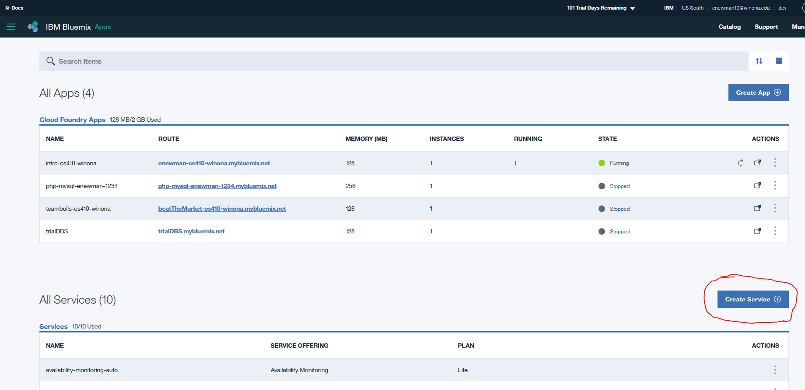

# Step 8: Watson Assistant \(formerly Conversation\)

In this section we will be using the Watson Developer Cloud Conversation API's to interface with Watson and

## Watson Access

1. Create a Bluemix account to gain access to a mix of Watson API's as well as a variety of other services: [Bluemix](https://www.ibm.com/cloud-computing/bluemix/)
2. Go to your dashboard page on Bluemix and select 'Create Service'
3. Create the Watson Assistant service and return to the 'dashboard' page. From there, scroll down to your newly created Conversation service offering and select it. 
4. In the Assistant listing, look at the Credentials section and take note of your username and password \(you may have to click "Show" to the top right\). These will be needed to access the service later. 

## Watson Developer Cloud

At this point your almost ready to start translating. Log in to your Python enabled Litmis Space and using the proper 'pip' version install the watson-developer-cloud library. At this point, you actually have a variety of Watson service API's ready for you to make use of including but not limited to Personality-Insights, Conversation, TextToSpeech, SpeechToText and many more. For many of these offerings, you will also need the 'json' Python library as Watson likes to send JSON response objects through many of the API calls.

As my time is limited, today I am only going to paste the code that illustrates the service running. At another date I plan to return to this section and add more details into how this is done as well as what modifications can be made to the service calls to affect the results Watson returns to us.

To get the SpeechToText service running, I downloaded a file from the internet named 'carlin\_reasoned.wav' and used this as my audio input for the service. Depending on the file you use, you may need to change the declared response model in the 'transcribe audio' method return call based on the size or makeup of your audio file. Should this be the case, you will receive a warning indicating so in the shell interface listing after the code has been executed.

You will also need to change the username and password values to match those of your service created in the previous 'Watson Access' section steps. Otherwise, the code simply creates a connection with the 'SpeechToText' Watson service and prints the returned JSON response object from this service when called. Hopefully this is helpful!

```text
import json
import os
from os.path import join, dirname
from watson_developer_cloud import SpeechToTextV1 as SpeechToText

def transcribe_audio(path_to_audio_file):
    username = 'yourUsername'
    password = 'yourPassword'
    speech_to_text = SpeechToText(username=username, password=password)
    with open(join(dirname(__file__), path_to_audio_file), 'rb') as audio_file:
       return speech_to_text.recognize(audio_file, content_type='audio/wav', model='en-US_NarrowbandModel')

print(transcribe_audio('carlin_reasoned.wav'))
```

